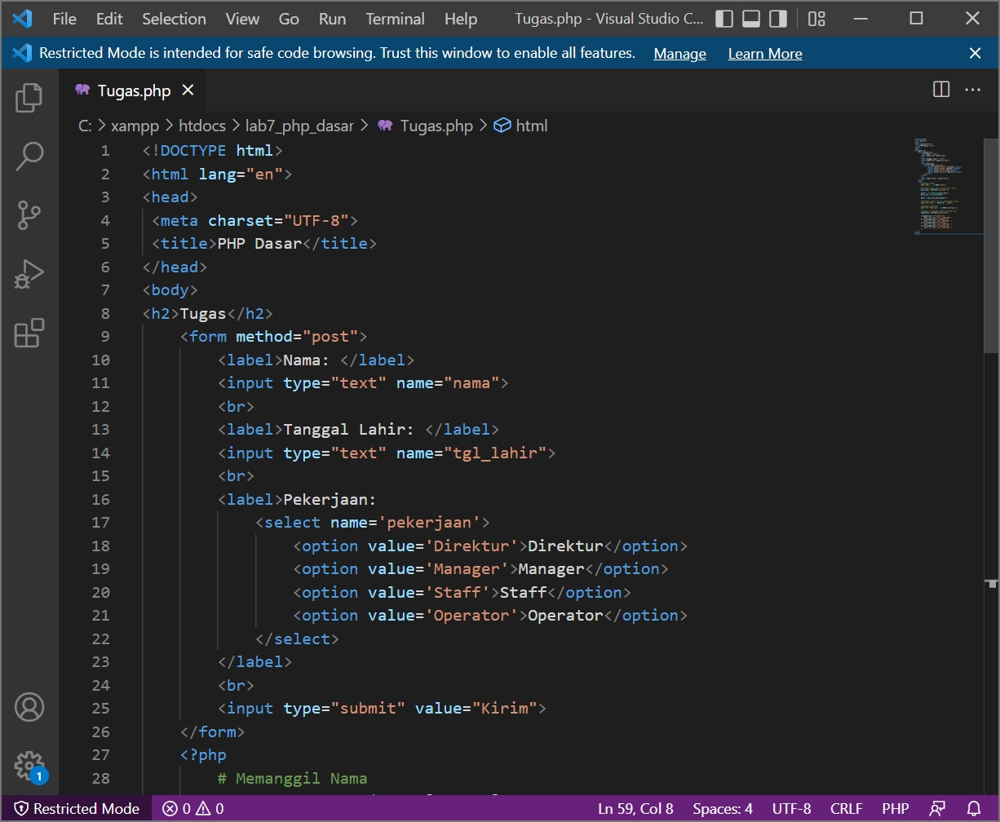

# 07_Lab7Web

TUGAS PERTEMUAN 9

PEMROGRAMAN WEB

TEKNIK INFORMATIKA

UNIVERSITAS PELITA BANGSA

NAMA  : GUNAWAN

NIM   : 312010191

KELAS : TI.20.B1

DOSEN : Agung Nugroho,S.Kom.,M.Kom

# Pemrograman Web: PHP Dasar

**Instruksi Praktikum** 
1. Persiapkan text editor misalnya VSCode.
2. Buat folder baru dengan nama lab7_php_dasar pada docroot webserver (htdocs)
3. Ikuti langkah-langkah praktikum yang akan dijelaskan berikutnya.
Langkah-langkah Praktikum
Persiapan
Untuk memulai membuat kode php, perlu disiapkan web server dan interpreter PHP 
terlebih dahulu. Web servar yang kita gunakan adalah Apache 2 dan interpreter PHP 7. 
Untuk memudahkan proses praktikum, kita gunakan aplikasi bundle web server yaitu 
XAMPP. 

**Install XAMPP** 
Unduh XAMPP dari https://www.apachefriends.org/download.html dan pilih versi 
portable untuk memudahkan proses installasi. Kemudian extract file tersebut, seusikan 
direktorinya.

**Menjalankan Web Server**

Untuk menjalankan web server dari menu XAMPP Control. 

Gambar 01. XAMPP Control

• Uji coba apakah server sudah berkerja dengan baik
http://127.0.0.1 atau http://localhost
Tampil halaman utama XAMPP jika server sudah berkerja dengan baik.
• Dokumen Website
Semua file website tempatkan di direktori: \xampp\htdocs\
• Database MySQL
Direktori: \xampp\mysql\
Manajemen database: http://localhost/phpmyadmin

**Memulai PHP**

Buat folder lab7_php_dasar pada root directory web server (C:\xampp\htdocs)

Gambar 02. Directory Lab7

Kemudian untuk mengakses direktory tersebut pada web server dengan mengakses URL: 
http://localhost/lab7_php_dasar/

Gambar 03. Tampilan Web Server

**PHP Dasar** 
Buat file baru dengan nama php_dasar.php pada directory tersebut. Kemudian buat 
kode seperti berikut. 
~~~
<!DOCTYPE html>
<html lang="en">
<head>
 <meta charset="UTF-8">
 <title>PHP Dasar</title>
</head>
<body>
 <h1>Belajar PHP Dasar</h1>
 <?php
 echo "Hello World";
 ?>
</body>
</html>
~~~

Gambar 04. Code Dasar PHP

Kemudian untuk mengakses hasilnya melalui URL: 
http://localhost/lab7_php_dasar/php_dasar.php

Gambar 05. Tampilan Dasar PHP

**Variable PHP**

Menambahkan variable pada program. 
~~~
<?php
$nim = "0411500400";
$nama = 'Abdullah';
echo "NIM : " . $nim . " ";
echo "Nama : $nama";
?>
~~~

Gambar 06. Code Variable PHP

Kemudian untuk mengakses hasilnya melalui URL: 

Gambar 07. Tampilan Variable PHP

**Predefine Variable $_GET**
~~~
<?php
echo 'Selamat Datang ' . $_GET['nama'];
?>
~~~

Gambar 08. Code Predefine Variable

Untuk mengaksesnya gunakan URL: 
http://localhost/lab7_php_dasar/latihan2.php?nama=Gunawan

Gambar 08. Tampilan Predefine Variable

**Membuat Form Input**
~~~
<!DOCTYPE html>
<html lang="en">
<head>
 <meta charset="UTF-8">
 <title>PHP Dasar</title>
</head>
<body>
<h2>Form Input</h2>
<form method="post">
 <label>Nama: </label>
 <input type="text" name="nama">
 <input type="submit" value="Kirim">
</form>
<?php
echo 'Selamat Datang ' . $_POST['nama'];
?>
</body>
</html>
~~~

Gambar 09. Code Form Input

Gambar 10. Tampilan Form Input

**Operator**
~~~
<?php
$gaji = 1000000;
$pajak = 0.1;
$thp = $gaji - ($gaji*$pajak);
echo "Gaji sebelum pajak = Rp. $gaji  ";
echo "Gaji yang dibawa pulang = Rp. $thp";
?>
~~~

Gambar 11. Code Operator

Gambar 12. Tampilan Operator

**Kondisi IF**
~~~
<?php
$nama_hari = date("l");
if ($nama_hari == "Sunday") {
 echo "Minggu";
} elseif ($nama_hari == "Monday") {
 echo "Senin";
} else {
 echo "Selasa";
}
?>
~~~

Gambar 12. Code Kondisi IF

Gambar 13. Tampilan Kondisi IF

**Kondisi Switch**
~~~
<?php
$nama_hari = date("l");
switch ($nama_hari) {
 case "Sunday":
 echo "Minggu";
 break;
 case "Monday":
 echo "Senin";
 break;
case "Tuesday":
 echo "Selasa";
 break;
 default:
 echo "Sabtu";
?>
~~~

Gambar 14. Code Kondisi Switch

Gambar 15. Tampilan Kondisi Switch

**Perulangan for**
~~~
<?php
echo "Perulangan 1 sampai 10  ";
for ($i=1; $i<=10; $i++) {
 echo "Perulangan ke: " . $i . ' ';
}
echo "Perulangan Menurun dari 10 ke 1  ";
for ($i=10; $i>=1; $i--) {
 echo "Perulangan ke: " . $i . ' ';
}
?>
~~~

Gambar 16. Code Perulangan for

Gambar 17. Tampilan Perulangan for

**Perulangan while**
~~~
<?php
echo "Perulangan 1 sampai 10  ";
$i=1;
while ($i<=10) {
 echo "Perulangan ke: " . $i . ' ';
 $i++;
}
?>
~~~

Gambar 18. Code Perulangan while

Gambar 19. Tampilan Perulangan while

**Perulangan dowhile**
~~~
<?php
echo "Perulangan 1 sampai 10  ";
$i=1;
do {
 echo "Perulangan ke: " . $i . ' ';
 $i++;
} while ($i<=10);
?>
~~~

Gambar 20. Code Perulangan dowhile

Gambar 21. Tampilan Perulangan dowhile

**Pertanyaan dan Tugas**

Buatlah program PHP sederhana dengan menggunakan form input yang menampilkan 
nama, tanggal lahir dan pekerjaan. Kemudian tampilkan outputnya dengan menghitung 
umur berdasarkan inputan tanggal lahir. Dan pilihan pekerjaan dengan gaji yang 
berbeda-beda sesuai pilihan pekerjaan.

 >**Jawab :**
 ~~~
<!DOCTYPE html>
<html lang="en">
<head>
 <meta charset="UTF-8">
 <title>PHP Dasar</title>
</head>
<body>
<h2>Tugas</h2>
  <form method="post">
    <label>Nama: </label>
    <input type="text" name="nama">
     
    <label>Tanggal Lahir: </label>
    <input type="text" name="tgl_lahir">
     
    <label>Pekerjaan:
      <select name='pekerjaan'>
                <option value='Direktur'>Direktur</option>
                <option value='Manager'>Manager</option>
                <option value='Staff'>Staff</option>
                <option value='Operator'>Operator</option>
      </select>
    </label>
     
    <input type="submit" value="Kirim">
  </form>
  <?php
        # Memanggil Nama
        echo 'Nama: ' . $_POST['nama'];
        # Merubah Tanggal Lahir menjadi Umur (Tahun)
        $tgl_lahir = @$_POST['tgl_lahir'];
        $lahir = new DateTime($tgl_lahir);
        $hari_ini = new DateTime();
        $diff = $hari_ini->diff($lahir);
        # Memanggil fungsi umur yg sudah dibuat diatas
        echo "  Umur: ". $diff->y ." Tahun";

        # Memanggil pekerjaan
        echo "  Pekerjaan: ". $_POST['pekerjaan'];

        # Kondisi if pekerjaan untuk menentukan gaji
        $pekerjaan = @$_POST['pekerjaan'];

        if($pekerjaan == "Direktur"){
            echo '  Gaji: Rp. 10.000.000,-';
        }elseif($pekerjaan == "Manager"){
            echo '  Gaji: Rp. 7.000.000,-';
        }elseif($pekerjaan == "Staff"){
            echo '  Gaji: Rp. 5.000.000,-';
        }elseif($pekerjaan == "Operator"){
            echo '  Gaji: Rp. 4.000.000,-';
        }
    ?>
</body>
</html>
~~~

Gambar 22. Code form input

Gambar 23. Tampilan form input
 
Cukup Sekian Penjelasan Dari Saya

**TERIMAKASIH**

